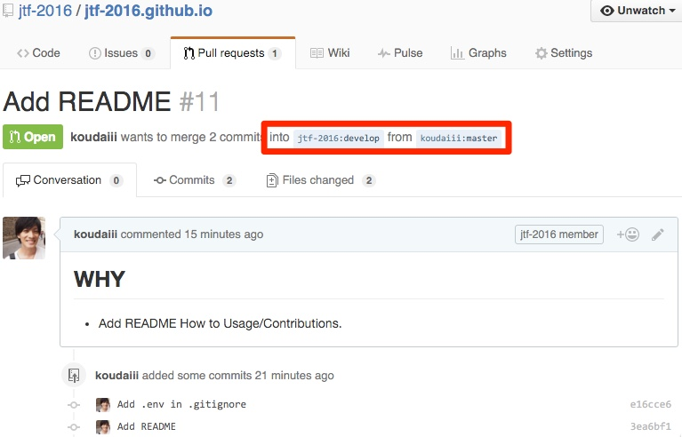

# 2016.techfesta.jp
July Tech Fest 2016

[](https://travis-ci.org/jtf-2016/jtf-2016.github.io)

## Japanese Document

* [日本語ドキュメント](doc/README.md)

## Usage

```bash
$ git clone https://github.com/jtf-2016/jtf-2016.github.io.git
$ cd jtf-2016.github.io
$ git checkout develop
$ bundle install
$ bundle exec middleman
```

## Contributions

* Please Fork it!

```bash
$ git clone git@github.com:<your_name>/jtf-2016.github.io.git
$ cd jtf-2016.github.io
$ git checkout develop
$ bundle install
$ git checkout -b [your_branch_name]
# Add Commit and Push
```

* Please Pull Request!

e.g. **into** `jtf-2016:develop` **from** `koudaiii:master`



## Manual Deploy

```bash
$ export GH_TOKEN=''
$ bundle exec rake deploy  # Build and publish to Github Pages
```
