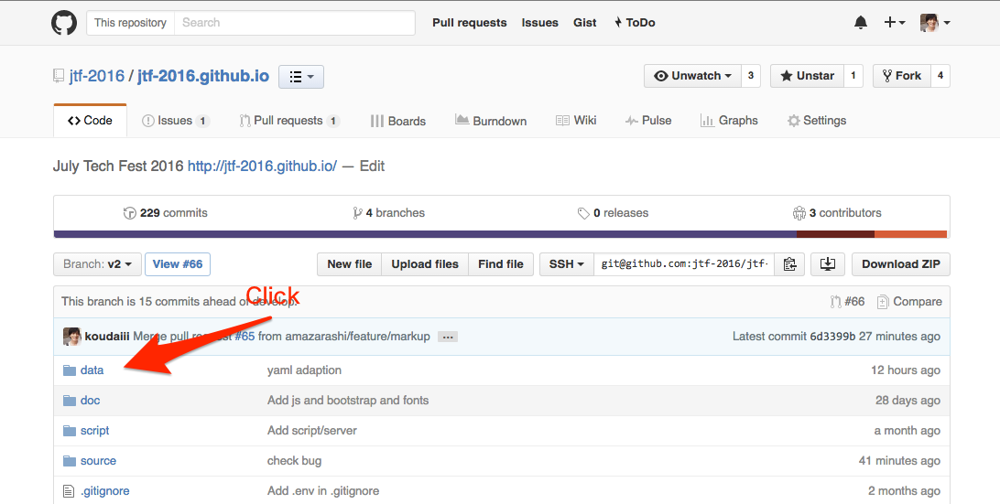
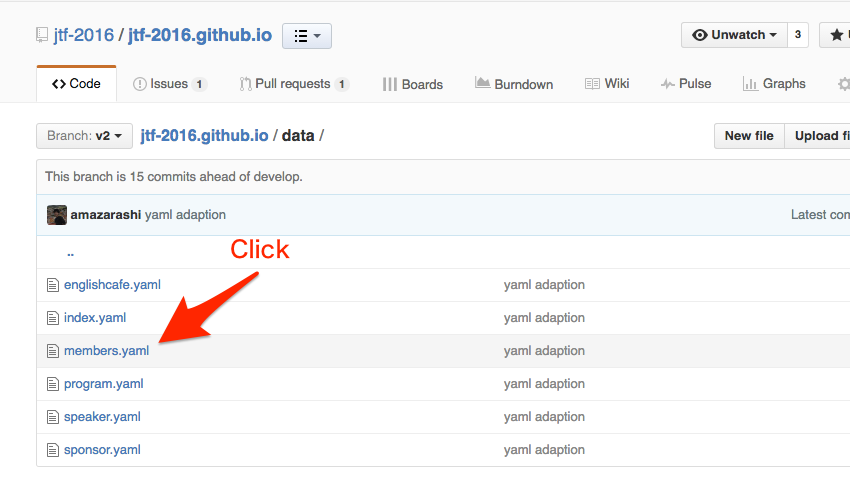
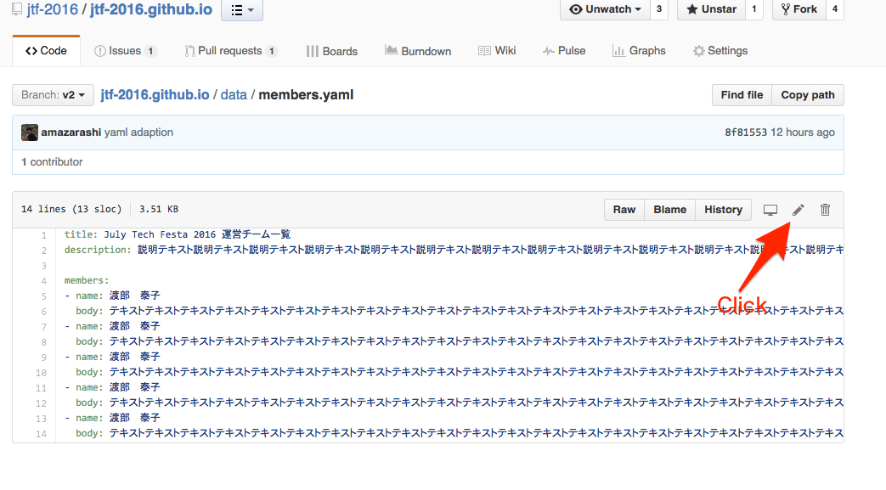
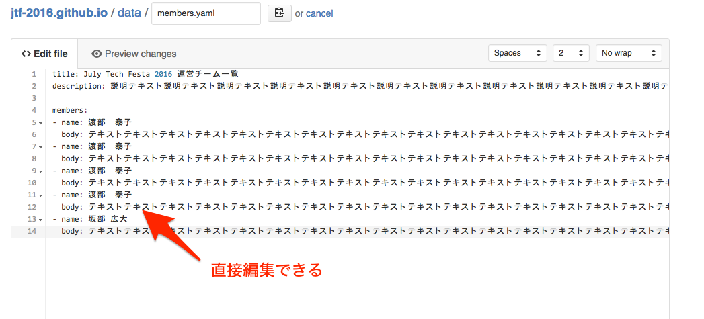
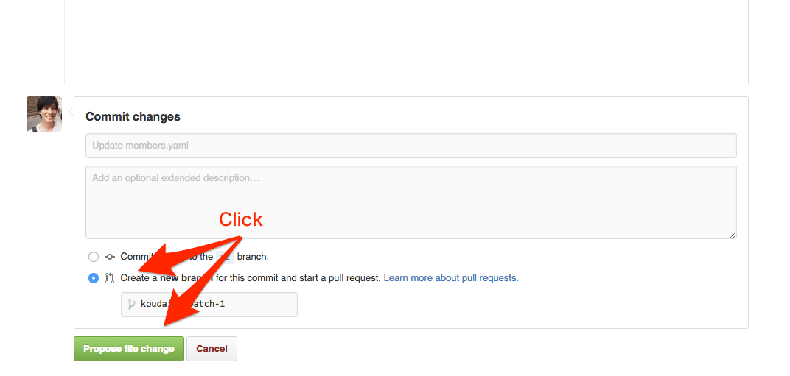
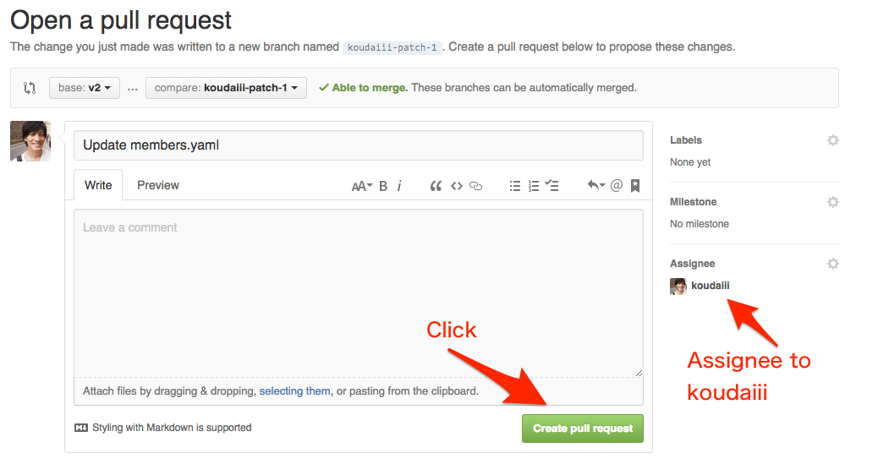

## コンテンツの更新

* URL: https://github.com/jtf-2016/jtf-2016.github.io

* data フォルダをクリック

* 編集したい画面の yaml ファイルをクリック

* :pencil2: 編集buttonをクリック

* 直接編集できます

* 下まで行くと Commit changes があるので、 「Create a **new branch** for this commit and start a pull request.」 を選択して、「Propose file change」をクリックする

* 最後に Assignee を選択して、 「 Create pull request」を押して終わりです :smile: Mergeされるまで待ちましょう :smile:

